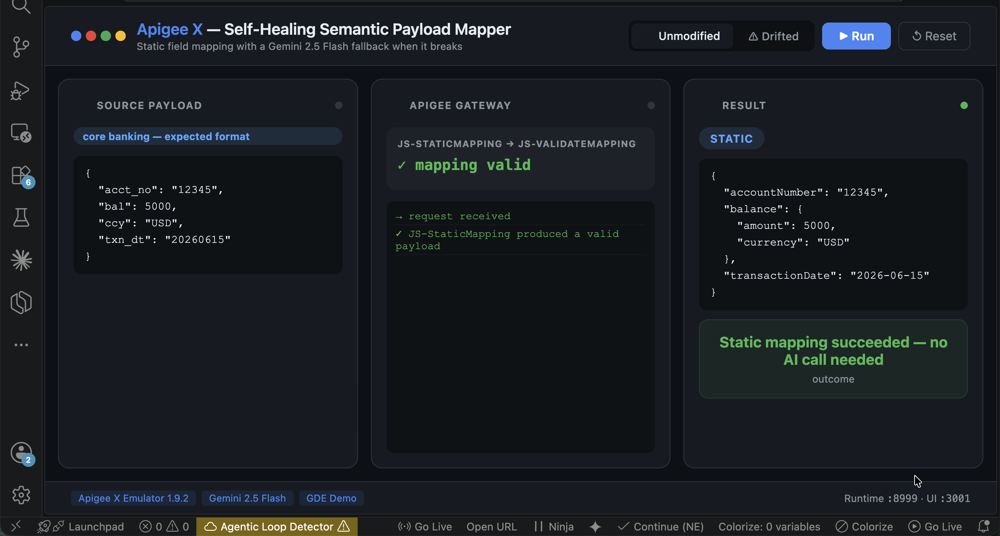
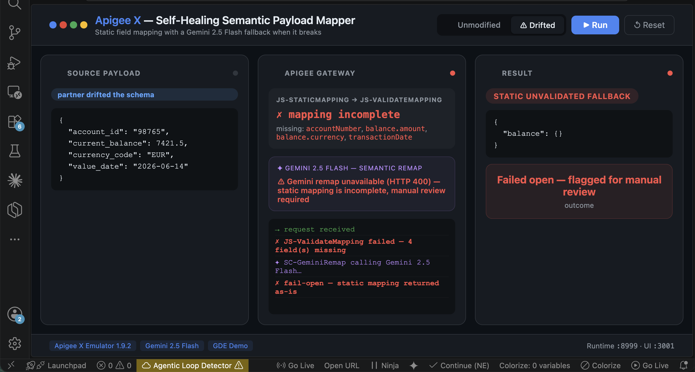

# Apigee X — Self-Healing Semantic Payload Mapper

> When a partner system silently renames a field, **Apigee X** + **Gemini 2.5 Flash** infer the new mapping in real time instead of breaking the integration.

[](https://cloud.google.com/apigee)
[](https://aistudio.google.com)
[](LICENSE)

---

## Demo

| ✅ Unmodified — static mapping works | ⚠ Drifted — static mapping breaks |
|:---:|:---:|
|  |  |
| Partner sends the expected format, no AI needed | Partner renames every field — fails open with an audit alert (or self-heals with a Gemini key) |

---

## What Problem Does This Solve?

Banks integrate constantly with third-party systems — legacy core banking platforms, fintech partners, payment providers — each with its own payload format, often poorly documented and changing without notice.

```
Core Banking (legacy)              Fintech Partner API
{                                   {
  "acct_no": "12345",                "accountNumber": "12345",
  "bal": 5000.00,                    "balance": { "amount": 5000.00, "currency": "USD" },
  "ccy": "USD",                      "transactionDate": "2026-06-15"
  "txn_dt": "20260615"             }
}
```

Today, a developer writes a static XSLT/AssignMessage mapping between the two. The moment the partner renames a field (`acct_no` → `account_id`), the mapping **breaks silently** — no error, just missing or null data — until a customer complains.

## The Idea

Apigee already owns payload transformation natively (`XSLT`, `JSONtoXML`, `AssignMessage`). This project keeps that static mapping as the fast, free, default path — and adds a **fallback layer**: when the static mapping produces an invalid result, Gemini 2.5 Flash looks at the actual source payload and the target schema, infers the correct field mapping from names/types/values, and returns the fully transformed payload. The decision is logged for audit either way.

```
Source payload
      │
      ▼
┌─────────────────────────────────────┐
│              APIGEE X                  │
│                                         │
│  JS-StaticMapping (fast, free,         │
│  the usual hand-written mapping)       │
│         │                              │
│         ▼                              │
│  JS-ValidateMapping — did it produce   │
│  a valid result?                       │
│      │           │                     │
│     yes          no (field renamed,    │
│      │            structure changed)   │
│      │                │                │
│      │                ▼                │
│      │     SC-GeminiRemap — Gemini     │
│      │     infers the new mapping      │
│      │     from source + target schema │
│      │                │                │
│      └──────┬─────────┘                │
│             ▼                          │
│   JS-AuditMappingDecision — logs the   │
│   method used (static / self-healed /  │
│   failed-open) + transformed payload   │
└─────────────────────────────────────┘
      │
      ▼
RF-FinalResponse (200, JSON)
```

**Fail-open by design**: if Gemini is unavailable or its response can't be parsed, the proxy returns the (incomplete) static mapping with an explicit `alert` field instead of pretending success — visibility over silent corruption.

## Quick Start

### Prerequisites
- Docker
- Python 3.8+
- A Gemini API key from [aistudio.google.com/apikey](https://aistudio.google.com/apikey) (free, starts with `AIza`)

### 1. Clone & configure

```bash
git clone https://github.com/saiflayouni/apigee-payload-mapper
cd apigee-payload-mapper
cp .env.example .env   # paste your Gemini key into .env
```

### 2. Deploy (one command)

```bash
bash deploy.sh
```

This builds the SDLC bundle, starts a dedicated Docker emulator (ports `8081`/`8999`, independent from other Apigee demos), deploys the proxy, and runs two smoke tests: an unmodified payload (static mapping) and a drifted one (Gemini self-heal).

### 3. Run the terminal demo

```bash
python3 demo.py           # before (static works) → after (partner drifts schema)
python3 demo.py before    # unmodified payload, static mapping succeeds
python3 demo.py after     # partner renames every field, Gemini self-heals
```

## Example: Self-Healed Response

Input (partner renamed every field):
```json
{
  "account_id": "98765",
  "current_balance": 7421.50,
  "currency_code": "EUR",
  "value_date": "2026-06-14"
}
```

Apigee response:
```json
{
  "mapping_method": "gemini_self_healed",
  "transformed_payload": {
    "accountNumber": "98765",
    "balance": { "amount": 7421.5, "currency": "EUR" },
    "transactionDate": "2026-06-14"
  },
  "audit": {
    "confidence": 1.0,
    "notes": "Matched 'account_id' to 'accountNumber', 'current_balance' to 'balance.amount', 'currency_code' to 'balance.currency', and 'value_date' to 'transactionDate' based on name similarity, data types, and value formats.",
    "static_mapping_missing_fields": ["accountNumber", "balance.amount", "balance.currency", "transactionDate"]
  }
}
```

## Project Structure

```
apigee-payload-mapper/
├── deploy.sh                              # One-command setup
├── demo.py                                # Terminal demo (before/after)
├── mocks/
│   ├── payload-ok.json                    # Matches the static mapping
│   ├── payload-drifted.json               # Partner renamed every field
│   └── target-schema.json                 # Expected output shape
│
└── apiproxy/                              # Apigee proxy bundle
    ├── payload-mapper.xml
    ├── policies/
    │   ├── JS-StaticMapping.xml
    │   ├── JS-ValidateMapping.xml
    │   ├── JS-BuildGeminiRemapRequest.xml
    │   ├── AM-BuildGeminiRemapRequest.xml
    │   ├── SC-GeminiRemap.xml
    │   ├── JS-ApplyGeminiMapping.xml
    │   ├── JS-AuditMappingDecision.xml
    │   └── RF-FinalResponse.xml
    ├── proxies/default.xml
    ├── targets/default.xml
    └── resources/
        └── jsc/
            ├── static-mapping.js
            ├── validate-mapping.js
            ├── build-gemini-remap-request.js
            ├── apply-gemini-mapping.js
            └── audit-mapping-decision.js
```

## Tech Stack

| Layer | Technology |
|---|---|
| API Gateway | Apigee X (local emulator `gcr.io/apigee-release/hybrid/apigee-emulator:1.9.2`) |
| Semantic AI | Gemini 2.5 Flash (`generativelanguage.googleapis.com`) |
| Static mapping & validation | JavaScript policies (Rhino engine) |
| Self-heal callout | ServiceCallout with `continueOnError="true"` (fail-open) |

## GDE Application Context

Built as a companion demo to the [Apigee X Agentic Loop Detector](https://github.com/saiflayouni/apigee-agent-loop-detector) for the **Google Developer Expert (GDE)** application in the Cloud/AI category. Same thesis, different Apigee primitive: native gateway capabilities (rate limiting, payload transformation) become adaptive once Gemini is wired in as a fallback, not a replacement.

## License

MIT — see [LICENSE](LICENSE)
